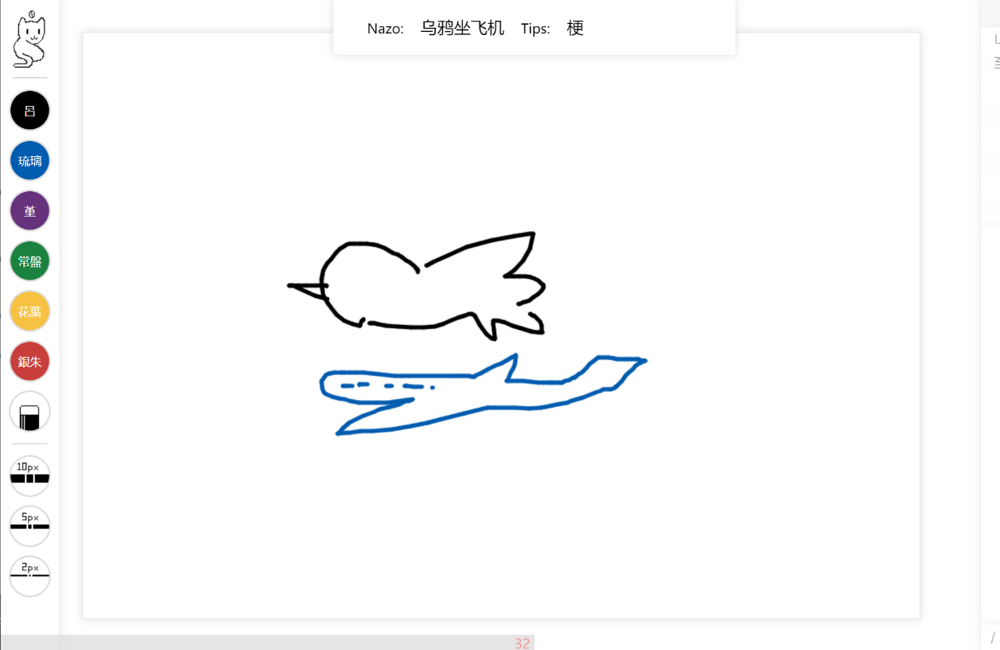
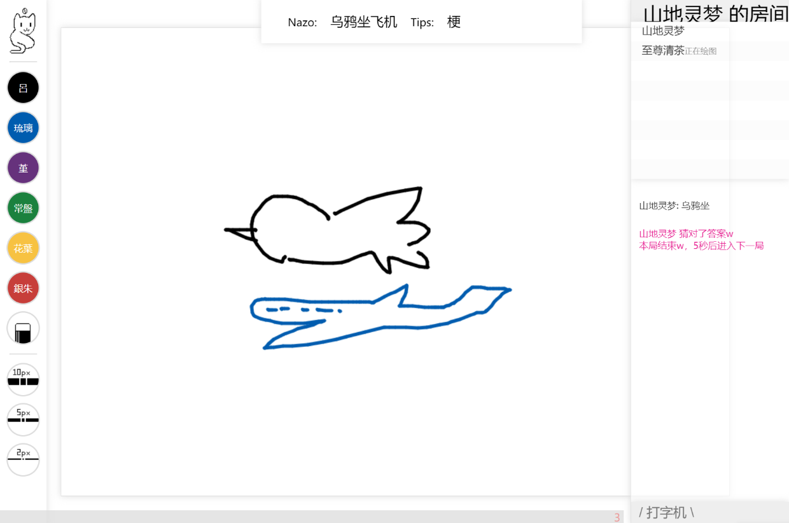

# Nekonazo0

Nekonazo亡了，假装自己再写一个Nekonazo0。

十分简单的你画我猜，内置自定义词语与提示，没有ui设计真是抱歉。

使用**node.js**，即开即玩无存档，建议使用**nohub**或**pm2**保持运行。

## 部署

#### 服务器

    在 `server/server.js` 中自定义端口。

    ```bash
        cd server
        npm update
        npc start
    ```    

#### 客户端

    使用 http 部署部署剩余内容，主页为 `index.html`。
    修改 `ft/app.js` 中的IP与端口即可。

## 词库

位于 `server/words/words_1.json`，可以借助 `addword/index.html` 来扩展或构筑词库。

## 预览





All rights reserved to Kitekii@2022.